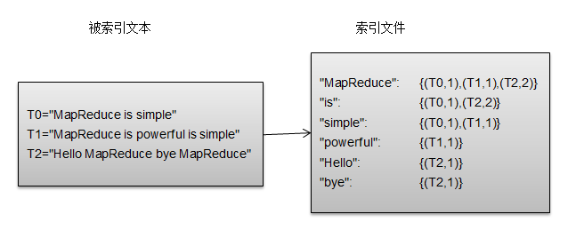
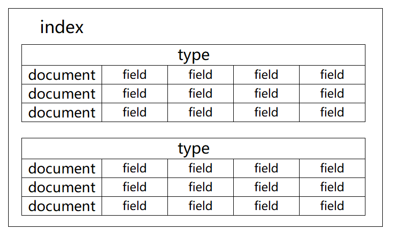
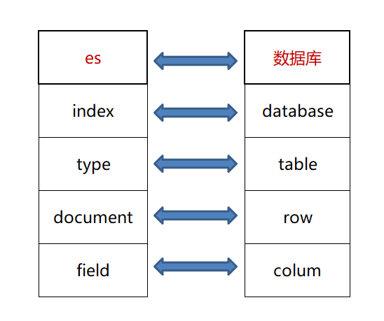
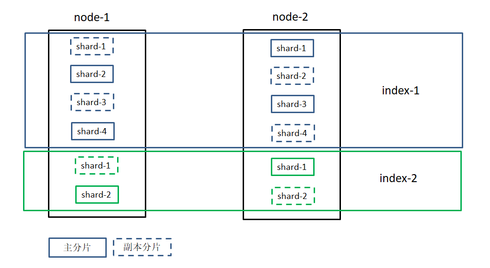
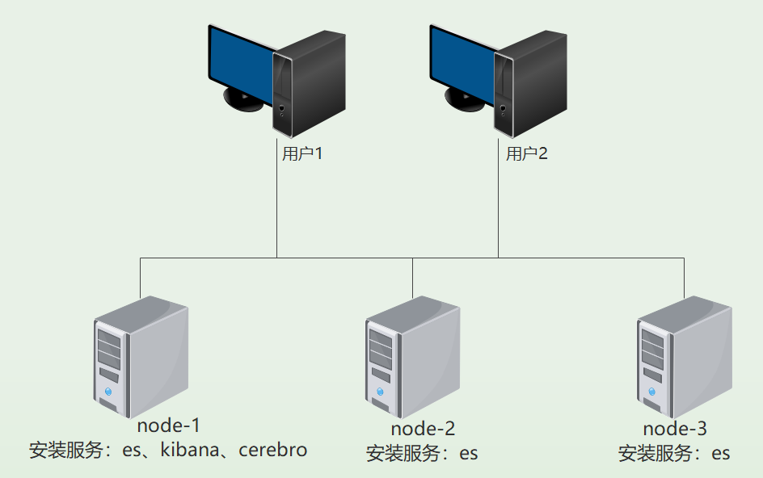

[TOC]

------

#### 一、Elasticsearch入门

##### 1.es是什么

​		es是一个基于Lucene构建的开源、分布式、Restful接口全文搜索引擎。它能够扩展数以百计的服务器以及处理PB级的数据，可以在很短的时间内搜索、分析大量的数据。

##### 2.Lucene倒排索引

​		Lucene是apache下的一个开源的全文检索引擎工具包。Lucene使用的是倒排索引结构。

​		倒排索引源于实际应用中需要根据属性的值来查找记录。这种索引表中的每一项都包括一个属性值和具有改属性值的的各记录的地址。由于不是由记录来确定属性值，而是由属性值来确定记录的位置，因而称为倒排索引。带有倒排索引的文件我们称为倒排索引文件，简称倒排文件。

​		


##### 3.索引结构





###### a.索引(index)

​	索引是具有相同文档结构的文档集合。

###### b.类型(type)

​	在索引中，可以定义一个或多个类型，类型是索引的逻辑分区。在一般情况下，一种类型被定义为具有一组公共字段的文档。

###### c.文档(document)

​	文档是存储在es中的一个json格式的字符串，存储了多个字段。每个文档存储在es中时都有唯一id，字段名称为"_id"。


##### 4.es分片相关概念




**分片**：

​		主分片、副本分片

​		作用：1.解决单个节点存储、内存的限制；2.

**主分片**

​		es可以把一个完整的索引分成多个分片，这样的好处是可以把一个大的索引拆分成多个，分布到不同的节点上。构成分布式搜索。分片的数量只能在索引创建前指定，并且索引创建后不能更改。

**副本分片**

​		es可以设置多个索引的副本，副本的作用一是提高系统的容错性，当某个节点某个分片损坏或丢失时可以从副本中恢复。二是提高es的查询效率，es会自动对搜索请求进行负载均衡。

**路由**

​		根据路由算法将文档写入到对应的分片上

​		shard_id = hash(routing) % number_of_primary_shards

​		routing默认为文档的id

**读写过程**


##### 5.es集群

​		在单台ES服务器节点上，随着业务量的发展索引文件慢慢增多，会影响到效率和内存存储问题等。我们可以采用ES集群，将单个索引的分片到多个不同分布式物理机器上存储，从而可以实现高可用、容错性等。ES集群中索引可能由多个分片构成，并且每个分片可以拥有多个副本。通过将一个单独的索引分为多个分片，我们可以处理不能在一个单一的服务器上面运行的大型索引，简单的说就是索引的大小过大，导致效率问题。不能运行的原因可能是内存也可能是存储。由于每个分片可以有多个副本，通过将副本分配到多个服务器，可以提高查询的负载能力。

​		一个集群中有多个节点，其中有一个为主节点，这个主节点是可以通过选举产生的，主从节点是对于集群内部来说的。es的一个概念就是去中心化，字面上理解就是无中心节点，这是对于集群外部来说的，因为从外部来看es集群，在逻辑上是个整体，你与任何一个节点的通信和与整个es集群通信是等价的。

**主节点**：		

​		添加节点到集群或从集群删除节点；

​		创建或删除索引；

​		维护着索引的基本信息：

​		将索引的基本信息同步给从节点，所有集群中每个节点都存有集群的所有索引的信息；

​		负载均衡：新建索引时将分片均衡的分配给集群的各个节点，当有一个新的节点加入时，也会触发负载均衡。

**从节点**：

​	维护负责的分片，索引写入、查询。

　　　

es具有如下优点：

- **横向可扩展性**：只需要增加一台服务器，做一点儿配置，启动一下es进程就可以加入到集群；
- **分片机制提供更好的分布性**：同一个索引分成多个分片，分布在多台服务器上，分而治之的方式可以提升处理效率；
- **高可用**：提供副本机制，一个分片可以设置多个副本，使得某台服务器在宕机的情况下，集群仍旧可以照常运行，并把服务器宕机丢失的数据信息复制恢复到其他可用节点上。


#### 二、搭建es

##### 1.es部署图

​		

##### 2.环境要求	

| Centos7.X  |
| ---------- |
| JDK8及以上 |

##### 3.节点分配

|   服务器地址   | 节点名称 |     角色      |        开放端口        |
| :------------: | :------: | :-----------: | :--------------------: |
| 192.168.137.10 |  node-1  | master & data | 9200、9300、9000、5601 |
| 192.168.137.20 |  node-2  | master & data |       9200、9300       |
| 192.168.137.30 |  node-3  | master & data |       9200、9300       |

##### 4.安装es

​	a.下载es、并解压到/opt/elasticsearch/ 目录下		

```bash
cd /opt
wget https://mirrors.huaweicloud.com/elasticsearch/5.6.14/elasticsearch-5.6.14.tar.gz
tar -zxvf elasticsearch-5.6.14.tar.gz
mv elasticsearch-5.6.14 elasticsearch
```

​	b.配置es用户，创建相应的文件夹，配置权限

```bash
#创建新用户，用户名为es
useradd es
#设置密码
passwd es
#创建es的data目录
mkdir -p /data/es/data/
#创建es的日志目录
mkdir -p /data/es/logs/
#给文件配置用户es权限
chown -R es /opt/elasticsearch/
chown -R es /data/es/data/
chown -R es /data/es/logs/
```

​	c.修改系统相关配置

```bash
#
sysctl -w vm.max_map_count=262144
#最后一行添加vm.max_map_count=262144
vim /etc/sysctl.conf
ulimit -l unlimited
# 增加如下两行
# * soft memlock unlimited
# * hard memlock unlimited
vim /etc/security/limits.conf
```

​	d.配置es的配置文件

​		**jvm.options**

​		配置文件位置: /opt/elasticsearch/config/jvm.options		

```yaml
## JVM configuration

################################################################
## IMPORTANT: JVM heap size
################################################################
##
## You should always set the min and max JVM heap
## size to the same value. For example, to set
## the heap to 4 GB, set:
##
## -Xms4g
## -Xmx4g
##
## See https://www.elastic.co/guide/en/elasticsearch/reference/current/heap-size.html
## for more information
##
################################################################

# Xms represents the initial size of total heap space
# Xmx represents the maximum size of total heap space

#配置堆
-Xms512m
-Xmx512m


```

**elasticsearch.yml**		

配置文件位置: /opt/elasticsearch/config/elasticsearch.yml

配置如下:

```yaml
# ======================== Elasticsearch Configuration =========================
#
# NOTE: Elasticsearch comes with reasonable defaults for most settings.
#       Before you set out to tweak and tune the configuration, make sure you
#       understand what are you trying to accomplish and the consequences.
#
# The primary way of configuring a node is via this file. This template lists
# the most important settings you may want to configure for a production cluster.
#
# Please consult the documentation for further information on configuration options:
# https://www.elastic.co/guide/en/elasticsearch/reference/index.html
#
# ---------------------------------- Cluster -----------------------------------
#
# Use a descriptive name for your cluster:
#集群名字,同一集群内所有节点必须相同
cluster.name: my-application
#
# ------------------------------------ Node ------------------------------------
#
# Use a descriptive name for the node:
# 节点名字，{HOSTNAME}:表示取主机名
node.name: node-1
#
# Add custom attributes to the node:
#
#node.attr.rack: r1
# 是否有资格成为主节点
node.master: true
# 是否是数据节点(存储数据、操作数据)
node.data: true
# 设置一台机子能运行的节点数目，一般采用默认的1即可，因为我们一般也只在一台机子上部署一个节点。
node.max_local_storage_nodes: 1
# ----------------------------------- Paths ------------------------------------
#
# Path to directory where to store the data (separate multiple locations by comma):
# 设置索引数据的存储路径，默认是es根目录下的data文件夹
path.data: /data/es/data
#
# Path to log files:
# 设置日志文件的存储路径，默认是es根目录下的logs文件夹
path.logs: /data/es/logs
#
# ----------------------------------- Memory -----------------------------------
#
# Lock the memory on startup:
#设置为true来锁住内存。
#因为当jvm开始swapping时es的效率会降低，所以要保证它不swap，可以把ES_MIN_MEM和ES_MAX_MEM两个环境变量设置成同一个值，
#并且保证机器有足够的内存分配给es。
#同时也要允许elasticsearch的进程可以锁住内存，Linux下可以通过`ulimit -l unlimited`命令。
bootstrap.memory_lock: true
#
# Make sure that the heap size is set to about half the memory available
# on the system and that the owner of the process is allowed to use this
# limit.
#
# Elasticsearch performs poorly when the system is swapping the memory.
#
# ---------------------------------- Network -----------------------------------
#
# Set the bind address to a specific IP (IPv4 or IPv6):
# 设置绑定的ip地址, node-1为192.168.137.10,node-2为192.168.137.20,node-3为192.168.137.30
network.host: 192.168.137.10
#
# Set a custom port for HTTP:
# 设置对外服务的http端口，默认为9200
http.port: 9200
#
# For more information, consult the network module documentation.
# 设置节点间交互的tcp端口，默认是9300
transport.tcp.port: 9300
# --------------------------------- Discovery ----------------------------------
#
# Pass an initial list of hosts to perform discovery when new node is started:
# The default list of hosts is ["127.0.0.1", "[::1]"]

# 设置集群中master节点的初始列表，可以通过这些节点来自动发现新加入集群的节点
discovery.zen.ping.unicast.hosts: ["192.168.137.10", "192.168.137.20", "192.168.137.30"]
#
# Prevent the "split brain" by configuring the majority of nodes (total number of master-eligible nodes / 2 + 1):
#
discovery.zen.minimum_master_nodes: 2
#
# For more information, consult the zen discovery module documentation.
#
# ---------------------------------- Gateway -----------------------------------
#
# Block initial recovery after a full cluster restart until N nodes are started:
#
gateway.expected_nodes: 2
#gateway.expected_master_nodes: 1
#gateway.expected_data_nodes: 2
#
gateway.recover_after_time: 5m
#
gateway.recover_after_nodes: 1
#
# For more information, consult the gateway module documentation.
#
# ---------------------------------- Various -----------------------------------
#
# Require explicit names when deleting indices:
#
#action.destructive_requires_name: true

```


##### 5.启动es

```bash
#切换到非root用户
su - es
cd /opt/elasticsearch/
#后台启动时，命令: ./bin/elasticsearch -d
./bin/elasticsearch

```


##### 6.测试es是否启动成功

```
http://192.168.137.10:9200
http://192.168.137.10:9200/_cat/nodes
http://192.168.137.10:9200/_cat/health
```

------


#### 三、搭建cerebro

> es集群管理工具

安装在192.168.137.10服务器上, 需要开放9000端口

```bash
cd /opt
wget https://github.com/lmenezes/cerebro/releases/download/v0.9.2/cerebro-0.9.2.zip
unzip  cerebro-0.9.2.zip
mv cerebro-0.9.2 cerebro
```

修改配置文件: application.conf

位置：/opt/cerebro/conf/application.conf

```properties
# A list of known hosts
hosts = [
  {
  	#es集群任一节点
    host = "http://192.168.137.10:9200"
    name = "my-application"
    headers-whitelist = [ "x-proxy-user", "x-proxy-roles", "X-Forwarded-For" ]
  }
  # Example of host with authentication
  #{
  #  host = "http://some-authenticated-host:9200"
  #  name = "Secured Cluster"
  #  auth = {
  #    username = "username"
  #    password = "secret-password"
  #  }
  #}
]
```

启动cerebro

```bash
cd /opt/cerebro/
# 启动成功后打开页面=>  http://192.168.137.10:9000/
nohup ./bin/cerebro &>>/dev/null &

```

------


#### 四、搭建Kibana

> dev tool

安装在192.168.137.10服务器上, 需要开放5601端口

```bash
cd /opt
wget https://mirrors.huaweicloud.com/kibana/5.6.14/kibana-5.6.14-linux-x86_64.tar.gz
tar -zxvf  kibana-5.6.14-linux-x86_64.tar.gz
mv kibana-5.6.14-linux-x86_64.tar.gz kibana
```

修改配置文件: kibana.yml

位置：/opt/kibana/config/kibana.yml

```yaml
# Kibana is served by a back end server. This setting specifies the port to use.
# kibana对外服务端口，默认5601
server.port: 5601

# Specifies the address to which the Kibana server will bind. IP addresses and host names are both valid values.
# The default is 'localhost', which usually means remote machines will not be able to connect.
# To allow connections from remote users, set this parameter to a non-loopback address.
# 主机地址
server.host: "192.168.137.10"

# The URLs of the Elasticsearch instances to use for all your queries.
# es服务地址(es任意或多个节点的地址)
elasticsearch.hosts: ["http://192.168.137.10:9200"]

```

启动Kibana

```bash
cd /opt/kibana/
# 启动成功后打开页面=> http://192.168.137.10:5601/
nohup ./bin/kibana &>>/dev/null &
```


#### 五、ik分词器

> 可以用来对中文分词的分词器，内置的分词器不支持对中文分词，需要扩展分词器

1.下载

​		https://github.com/medcl/elasticsearch-analysis-ik/releases

​		根据es的版本下载对应版本的ik分词器

2.将ik分词器解压到es的plugins目录下	

```
cd /opt/elasticsearch/plugins/
mkdir ik
cd ik
unzip elasticsearch-analysis-ik-5.6.14.zip
```

3.重启es

4.测试ik分词器

```http
#ik_max_word
POST _analyze
{
  "analyzer": "ik_max_word",
  "text": "江苏省常州市武进区湖塘镇星河国际"
}

#ik_smart
POST _analyze
{
  "analyzer": "ik_smart",
  "text": "江苏省常州市武进区湖塘镇星河国际"
}
```

5.配置自定义词典

​	配置文件位置

​	/opt/elasticsearch/plugins/ik/config/IKAnalyzer.cfg.xml

```bash
vim /opt/elasticsearch/plugins/ik/config/IKAnalyzer.cfg.xml
```

```xml
<?xml version="1.0" encoding="UTF-8"?>
<!DOCTYPE properties SYSTEM "http://java.sun.com/dtd/properties.dtd">
<properties>
	<comment>IK Analyzer 扩展配置</comment>
	<!--用户可以在这里配置自己的扩展字典 -->
	<entry key="ext_dict">ext.dic</entry>
	 <!--用户可以在这里配置自己的扩展停止词字典-->
	<entry key="ext_stopwords"></entry>
	<!--用户可以在这里配置远程扩展字典 -->
	<!-- <entry key="remote_ext_dict">words_location</entry> -->
	<!--用户可以在这里配置远程扩展停止词字典-->
	<!-- <entry key="remote_ext_stopwords">words_location</entry> -->
</properties>
```

```bash
touch /opt/elasticsearch/plugins/ik/ext.dic
vim /opt/elasticsearch/plugins/ik/ext.dic
```

------


#### 六、字段类型

- 字符串 - text
      可以分词

- 字符串 - keyword
      不能分词，只能搜索该字段的完整的值

- 数值型
      long：有符号64-bit integer：-2^63 ~ 2^63 - 1
      integer：有符号32-bit integer，-2^31 ~ 2^31 - 1
      short：有符号16-bit integer，-32768 ~ 32767
      byte： 有符号8-bit integer，-128 ~ 127
      double：64-bit IEEE 754 浮点数
      float：32-bit IEEE 754 浮点数

- 布尔 - boolean

- 日期 - date
      由于Json没有date类型，所以es通过识别字符串是否符合format定义的格式来判断是否为date类型
      format默认为：strict_date_optional_time||epoch_millis format


#### 七、DSL语法

##### 1.索引index

​	a.创建索引	

```http
PUT http://localhost:9200/索引名称
{
	"settings":{
	  #分片数量
      "number_of_shards":4,
      #副本分片数量
	  "number_of_replicas":1
  	}
}
```

​	b.删除索引	

```http
DELETE http://localhost:9200/索引名称
```

​	c.查询索引信息

```http
GET http://localhost:9200/索引名称
```

​	d.打开、关闭索引

```http
#
POST http://localhost:9200/索引名称/_open
#
POST http://localhost:9200/索引名称/_close
#打开所有索引
POST http://localhost:9200/_all/_open
#关闭所有索引
POST http://localhost:9200/_all/_close
```


##### 2.映射mapping

​	a.创建映射	

```http
PUT http://localhost:9200/索引名称/_mapping/mappingName
{
	"properties":{
	"field1":{
		"type":"text",
		"index":true
	},
	"field2":{
		#字段类型
		"type":"text",
		
		#该字段是否创建索引,默认为true
		"index":true,
		
		#分词器(ik_max_word/ik_smart)
		"analyzer":"standard",
		
		#搜索分词器
		"search_analyzer":"",

	}
}
```

​	b.查询映射信息

```http
#获得索引的所有类型信息
GET http://localhost:9200/索引名称/_mappings
#获得索引的某一个类型信息
GET http://localhost:9200/索引名称/_mapping/mappingName
```


##### 3.文档document

​	a.新建文档

```http
#方式一：自己设置文档id(_id字段)
PUT http://localhost:9200/索引名称/类型名称/文档id
{
    "name":"es"，
    "age":18
}
#方式二：es自动生成文档id
POST http://localhost:9200/索引名称/类型名称
{
	"name":"es"，
    "age":18
}
```

​	b.更新文档

```http
#删除原来的那个id文档，新建一个新的文档
POST http://localhost:9200/索引名称/类型名称/文档id
{
    "name":"es"，
    "age":18
}

#更新部分字段,或者增加字段
POST http://localhost:9200/索引名称/类型名称/文档id/_update
{
    "doc":{
        #要更新的字段,如下将name字段更新为lucence,age字段更新为20,增加一个addr字段
        "name":"lucence"，
        "age":20，
        "addr":"XH"
    }
}
```

​	c.删除文档

```http
DELETE http://localhost:9200/索引名称/类型名称/文档id
```

​	d.获取文档

```http
GET http://localhost:9200/索引名称/类型名称/文档id

#查询所有文档数据
GET http://localhost:9200/索引名称/类型名称/_search

#批量查询
GET http://localhost:9200/索引名称/类型名称/_mget
{	
    #要查询的文档的id数组
    "ids":["001","003"]
}
```


##### 4.搜索

###### 	a.term/terms

```http
POST http://localhost:9200/索引名称/类型名称/_search
{
	"query": {
        "term": {
          #不会对"str"进行分词，查询"fieldName"字段中含有"str"词项的文档
          "fieldName":"str"
          }
    }
}

#terms
POST http://localhost:9200/索引名称/类型名称/_search
{
  "query": {
    "terms": {  //不会对"str1""str2","str3"...,进行分词，查询"fieldName"字段中含有"str1"或"str2"或"str3"...词项的文档
      "fieldName": [
        "str1",
        "str2",
        "str3",
        ...
      ]
    }
  }
}
```

###### b.match_all

```http
#返回所有文档
POST http://localhost:9200/索引名称/类型名称/_search
{
    "query": {
    	"match_all": {}
    }
}
```

###### c.match

```
POST http://localhost:9200/索引名称/类型名称/_search
{
  "query": {
    "match": {      //会对"str"进行分词，查询"fieldName"字段中含有"str"分词后一个或多个词项的文档
      "fieldName": "str"
    }
  }
}
```

###### d.match_phrase

```http
#短语查询
POST http://localhost:9200/索引名称/类型名称/_search
{
  "query": {
    "match_phrase": {  //会对"str"进行分词，查询"fieldName"字段中含有"str"分词后所有词项的文档，且每一个词项的相对位置不变，即完全匹配"str"
      "fieldName": "str"
    }
  }
}
```

###### e.match_phrase_prefix

```http
#前缀匹配查询
POST http://localhost:9200/索引名称/类型名称/_search
{
  "query": {
    "match_phrase_prefix": { //查询"fieldName"字段中以"str"开头的文档（会对"str"进行分词）
      "fieldName": "str"
    }
  }
}
```

###### f.range

```http
#范围查询
POST http://localhost:9200/索引名称/类型名称/_search
{
  "query": {
    "range": {
      "fieldName": {
        "gte": 10,
        "lte": 20
        //"lt": 20
        //"gt": 10
      }
    }
  }
}
```

###### g.排序、分页

```http
#返回所有文档
POST http://localhost:9200/索引名称/类型名称/_search
{
    "query": {
    	"match_all": {}
    },
  #排序，数组内可以设置多个字段
  "sort": [
    {
      "age": {
        "order": "desc"
      }
    }
  ],
  
  #分页，size大小不能超过index.max_result_window设置值，默认为10000
  "from": 0,
  "size": 3
}
```

###### h.bool

```http
#布尔查询
POST http://localhost:9200/索引名称/类型名称/_search
{
  "query": {
    "bool": {
      "filter": {   //必须全部满足，过滤查询，不计算相关性评分，且缓存结果，性能比query更高
      },
      "must": [     //必须全部满足
        {}
      ],
      "must_not": [     //必须全部不满足
        {}
      ],
      "should": [       //可以满足0个或多个，满足的越多评分越高；当没有上面的filter、must、must_not时，此时should相当于or查询
        {}
      ]
    }
  }
}


```

###### i.wildcard

```HTTP
#通配符查询
# *:表示0个或者多个字符
# ?:表示任意一个字符
POST http://localhost:9200/索引名称/类型名称/_search
{
  "query": {
    "wildcard": { 
      "fieldName": {
        "value": "*hello*"
      }
    }
  }
}
```


#### 八、相关网站

- 下载es:

​			https://mirrors.huaweicloud.com/elasticsearch/?C=N&O=D

- 下载kibana

  ​	https://mirrors.huaweicloud.com/kibana/?C=N&O=D

- es官方文档

  ​	https://www.elastic.co/cn/downloads/past-releases#elasticsearch

- 下载cerebro

  ​	https://github.com/lmenezes/cerebro/releases

#### 九、示例

cerebro--es集群管理地址：

​	http://121.196.50.38:9000/#/overview?host=my-application

kibana--开发工具：

​	http://121.196.50.38:5601/app/kibana#/dev_tools


##### 1.根据条件搜索学生信息

学生(student)相关字段

|   字段名称   |  类型   |   描述   |
| :----------: | :-----: | :------: |
|      id      |  long   |   主键   |
|    stu_no    | keyword |   学号   |
|   stu_name   |  text   |   姓名   |
|   stu_age    | integer |   年龄   |
| stu_birthday |  date   | 出生日期 |
|   stu_addr   |  text   |   地址   |


##### 2.创建索引	

```http
#创建索引（创建数据库）
PUT student
{
  "settings":{
      "number_of_shards":4,
		  "number_of_replicas":1
  }
}
```


##### 3.创建mapping

```http
#创建映射（创建表）
PUT student/_mapping/student
{
  "properties": {
    "id":{
      "type": "long",
      "index": true
    },
    "stu_no":{
      "type": "keyword",
      "index": true
    },
    "stu_name":{
      "type": "keyword",
      "index": true
    },
    "stu_age":{
      "type": "integer",
      "index": true
    },
    "stu_birthday":{
      "type": "date",
     "format": "yyyy-MM-dd"
    },
    "stu_addr":{
      "type": "text",
      "index": true,
      "analyzer":"ik_max_word"
    }
  }
}
```


##### 4.查询所有文档

```http
GET student/student/_search
{
  "query": {
    "match_all": {}
  }
}
```


##### 5.插入文档数据

```http
#插入数据
PUT student/student/1
{
  "id": 1,
  "stu_no": "A001",
  "stu_name": "张雨绮",
  "stu_age": 20,
  "stu_birthday": "2000-01-01",
  "stu_addr": "江苏省常州市武进区星河国际"
}

PUT student/student/2
{
  "id": 2,
  "stu_no": "A002",
  "stu_name": "陈乔恩",
  "stu_age": 19,
  "stu_birthday": "2001-03-19",
  "stu_addr": "江苏省常州市新北区大名城"
}

PUT student/student/3
{
  "id": 3,
  "stu_no": "A003",
  "stu_name": "陈楚生",
  "stu_age": 20,
  "stu_birthday": "2000-07-21",
  "stu_addr": "江苏省常州市武进区御城"
}

PUT student/student/4
{
  "id": 4,
  "stu_no": "A004",
  "stu_name": "李宗盛",
  "stu_age": 21,
  "stu_birthday": "1999-12-05",
  "stu_addr": "江苏省常州市武进区大学新村"
}

PUT student/student/5
{
  "id": 5,
  "stu_no": "A005",
  "stu_name": "陈慧琳",
  "stu_age": 20,
  "stu_birthday": "2000-11-16",
  "stu_addr": "江苏省常州市天宁区红梅新村"
}

PUT student/student/6
{
  "id": 6,
  "stu_no": "A006",
  "stu_name": "张曼玉",
  "stu_age": 20,
  "stu_birthday": "2000-03-13",
  "stu_addr": "江苏省常州市武进区新城南都"
}

PUT student/student/7
{
  "id": 7,
  "stu_no": "A007",
  "stu_name": "张信哲",
  "stu_age": 19,
  "stu_birthday": "2001-03-19",
  "stu_addr": "江苏省常州市天宁区华润国际社区"
}

PUT student/student/8
{
  "id": 8,
  "stu_no": "A008",
  "stu_name": "李若彤",
  "stu_age": 19,
  "stu_birthday": "2001-09-11",
  "stu_addr": "江苏省常州市钟楼区雨润城"
}

PUT student/student/9
{
  "id": 9,
  "stu_no": "A009",
  "stu_name": "陈紫函",
  "stu_age": 20,
  "stu_birthday": "2000-04-13",
  "stu_addr": "江苏省常州市武进区湖塘镇星河国际"
}

PUT student/student/10
{
  "id": 10,
  "stu_no": "A010",
  "stu_name": "周传雄",
  "stu_age": 20,
  "stu_birthday": "2000-09-02",
  "stu_addr": "江苏省常州市武进区湖塘镇星河国际"
}
```


##### 6.搜索文档

###### a.根据id搜索学生

```http
#id = 3
POST student/_search
{
  "query": {
    "term": {
      "id": {
        "value": "3"
      }
    }
  }
}
```

​	

```http
#6 <= id <= 8
POST student/_search
{
  "query": {
    "range": {
      "id": {
        "gte": 6,
        "lte": 8
      }
    }
  }
}
```

###### b.根据学号搜索学生

```
#stu_no = "A004"
POST student/_search
{
  "query": {
    "term": {
      "stu_no": {
        "value": "A004"
      }
    }
  }
}
```

###### c.根据姓名模糊搜索学生

```http
#模糊
POST student/_search
{
  "query": {
    "wildcard": {
      "stu_name": "张*"
    }
  }
}
```

###### e.根据出生日期搜索学生

```http
POST student/_search
{
  "query": {
    "range": {
      "stu_birthday": {
        "gte": "2000-09-01",
        "lte": "2001-04-13",
        "format": "yyyy-MM-dd"
      }
    }
  }
}
```

###### f.根据地址搜索

```http
POST student/_search
{
  "query": {
    "match": {
      #math查询会对"常州市湖塘镇"先分词，分别为"常州市"、"湖"、"塘"、"镇",然后再搜索stu_addr字段中有"常州市"或者"湖"、"塘"、"镇"的文档
      "stu_addr": "常州市湖塘镇"
    }
  }
}
```

###### g.组合搜索(bool查询)

```http
#查询年龄20岁，地址为武进区的，出生日期为2000-04-01~2001-08-31，姓名不为陈紫函的学生
POST student/_search
{
  "query": {
    "bool": {
      "filter": {
        "term": {
          "stu_age": "20"
        }
      },
      "must": [
        {
          "match_phrase": {
            "stu_addr": "武进区"
          }
        },
        {
          "range": {
            "stu_birthday": {
              "gte": "2000-04-01",
              "lte": "2001-08-31",
              "format": "yyyy-MM-dd"
            }
          }
        }
      ],
      "must_not": [
        {
          "term": {
            "stu_name": {
              "value": "陈紫函"
            }
          }
        }
      ]
    }
  }
}
```


